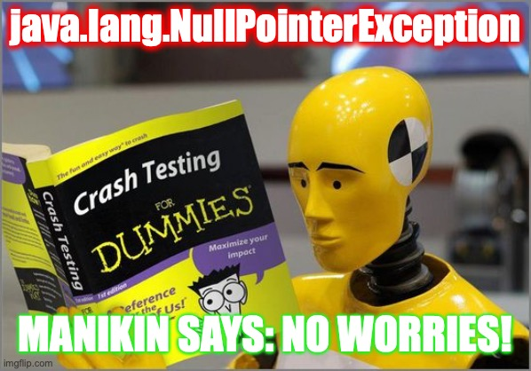

# Manikin
Manikin is an embedded Domain Specific Language (DSL) that implements 'Worldly' Objects - Objects that participate and interact in the scope of Worlds.
With Manikin, you can guard Object states with pre- and post- Conditions, and optionally track all stateful Effects and dispatched Messages.

Manikin is heavily inspired by the [Eiffel](https://www.eiffel.com) programming language, [Software Transactional Memory](https://en.wikipedia.org/wiki/Software_transactional_memory) and [Worlds](http://www.vpri.org/pdf/tr2011001_final_worlds.pdf) that have similar goals.

### Message dispatch through Worlds
Messages are dispatched to Objects via Worlds, which are then functionally updated and passed through after each (nested) dispatch.
Because Worlds can track of all intermediate and previous Object states, it is very easy to rollback state in case of failure, or to retry work after conflicts. 

### Immutability
All Objects, Messages and Worlds should be preferable immutable. All new states are created based on old states. 
Interestingly, Manikin enables purely-functional Object Orientated Programming, without resorting to Monads.
(Monadic programming in Java is very verbose, because Java lacks convenient flatMap syntax).

### Concurrent and Distributed
Manikin can also be configured to run on top of multi-threaded, concurrent or distributed Worlds - backed by databases such as [CockroachDB](https://www.cockroachlabs.com) - with strong [Serializability](https://en.wikipedia.org/wiki/Serializability) guarantees.  
                                                           
### Syntax and Types
You can succinctly specify Objects, Identities, Messages, Conditions and Effects with Manikin *and* statically type them (making heavy use of Java Generics).
Additionally, Manikin reduces the amount of Java boilerplate code to the absolute minimum by applying a sophisticated builder pattern to specify Messages.
Indeed, Java boilerplate can be even more reduced when using modern constructs like Records or by generating data classes with project Lombok.
                                                             
### Java, Scala and Kotlin
The core abstract API is developed in Java 1.8 and has NO dependencies. There are also Scala and Kotlin versions that are build on top of core Java API.
Of course, Scala and Kotlin require less boilerplate.

Here is a minimal 'Bank' example to get a feel of Manikin.
You will also find the Scala version which is more compact.

```java
public class SimpleTransfer {
    public static void main(String[] args) {
        AccountModule.ID a1 = new AccountModule.ID("A1");
        AccountModule.ID a2 = new AccountModule.ID("A2");
        TransferModule.ID t1 = new TransferModule.ID(1L);
        
        Value<SimpleWorld, Void> result = new SimpleWorld().
            send(a1, new AccountModule.Open<>(50.0)).
            send(a2, new AccountModule.Open<>(80.0)).
            send(t1, new TransferModule.Book<>(a1, a2, 30.0));
        
        System.out.println(result.obj(a1).value.balance); // 20.0
        System.out.println(result.obj(a2).value.balance); // 110.0
    }
}
```

```java
public interface AccountModule {
    class ID implements Id<Account> {
        public final String id;
        public ID(String id) { this.id = id; }
        @Override public Account init() { return new Account(0.0); }
    }
    
    class Account {
        public final Double balance;
        public Account(Double balance) { this.balance = balance; }
    }
    
    interface AccountMsg<W extends World<W>> extends LocalMessage<W, ID, Account, Void> { }
    
    class Open<W extends World<W>> implements AccountMsg<W> {
        public final Double initial;
        public Open(Double initial) { this.initial = initial; }
    
    
        @Override public Msg<W, ID, Account, Void> local() { return
            pre(() -> true).
            app(() -> new Account(initial)).
            eff(() -> null).
            pst(() -> obj().balance == initial);
        }
    }
    
    class Deposit<W extends World<W>> implements AccountMsg<W> {
        public final Double amount;
        public Deposit(Double amount) { this.amount = amount; }
        
        @Override public Msg<W, ID, Account, Void> local() { return
            pre(() -> true).
            app(() -> new Account(obj().balance + amount)).
            eff(() -> null).
            pst(() -> obj().balance == old().balance + amount);
        }
    }
    
    class Withdraw<W extends World<W>> implements AccountMsg<W> {
        public final Double amount;
        public Withdraw(Double amount) { this.amount = amount; }
    
    
        @Override public Msg<W, ID, Account, Void> local() { return
            pre(() -> true).
            app(() -> new Account(obj().balance - amount)).
            eff(() -> null).
            pst(() -> obj().balance == old().balance - amount);
        }
    }
}
```

```java
public interface TransferModule {
    class ID implements Id<Transfer> {
        public final Long id;
        public ID(Long id) { this.id = id; }
        @Override public Transfer init() { return new Transfer(null, null, 0.0); }
    }
    
    class Transfer {
        public final AccountModule.ID from;
        public final AccountModule.ID to;
        public final Double amount;
        
        public Transfer(AccountModule.ID from, AccountModule.ID to, Double amount) {
            this.from = from;
            this.to = to;
            this.amount = amount;
        }
    }
    
    interface TransferMsg<W extends World<W>> extends LocalMessage<W, ID, Transfer, Void> { }
    
    class Book<W extends World<W>> implements TransferMsg<W> {
        public final AccountModule.ID from;
        public final AccountModule.ID to;
        public final Double amount;
        
        public Book(AccountModule.ID from, AccountModule.ID to, Double amount) {
            this.from = from;
            this.to = to;
            this.amount = amount;
        }
        
        @Override public Msg<W, ID, Transfer, Void> local() { return
            pre(() -> amount > 0.0 && from != to).
            app(() -> new Transfer(from, to, amount)).
            eff(() -> {
                        send(from, new AccountModule.Withdraw<>(amount));
                return  send(to, new AccountModule.Deposit<>(amount));
            }).
            pst(() -> obj(from).balance + obj(to).balance == old(from).balance + old(to).balance);
        }
    }
}
```
